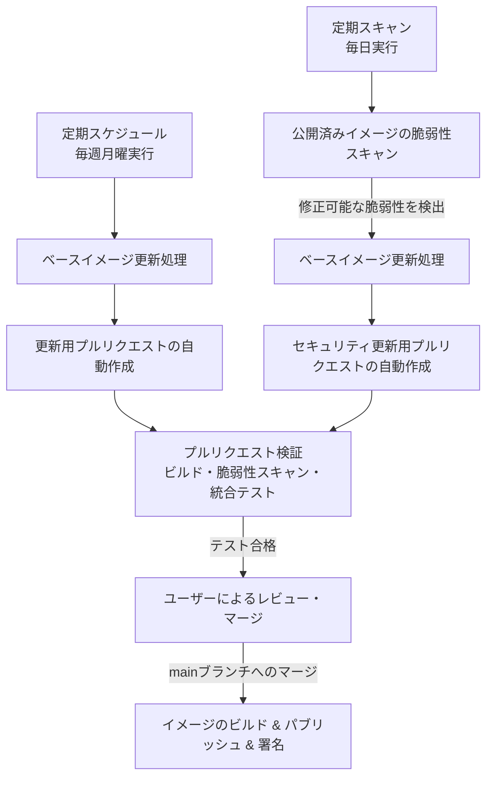

# ベースイメージの自動更新およびリリースフロー

## 背景と問題の本質 (Context and Problem Statement)

Debian などのコンテナベースイメージは、セキュリティパッチの適用やバグ修正のために定期的に更新されます。コンテナイメージの安全性を保つためには、これらの更新に追従し、検証し、安全に署名してリリースする仕組みが必要です。
本プロジェクトでは、ベースイメージ of ダイジェスト値（Digest）を自動的に更新し、テストを経てコンテナレジストリへリリースし、署名するまでのプロセスを自動化しています。
この自動化されたワークフロー全体のアーキテクチャ、トリガー、および各プロセスの役割をドキュメント化します。

## 決定要因 (Decision Drivers)

* **セキュリティ**: 脆弱性パッチが適用された最新のベースイメージを迅速かつ継続的に追従する。
* **自動化**: 人間による手動のダイジェスト値確認・書き換え作業を排除する。
* **信頼性**: 本番公開前にビルドテスト、脆弱性スキャン、および機能テストを確実に実施する。
* **改ざん防止**: リリースされたイメージに対して署名を行い、真正性を保証する。

## 意思決定の結慢 (Decision Outcome)

以下のような自動更新・検証・リリースパイプラインを採用しました。

### ワークフロー全体の流れ (Workflow Pipeline Overview)

### 各プロセスの詳細 (Workflow Process Details)

| プロセス | トリガー (Trigger) | 主な役割・動作 (Actions) |
| :--- | :--- | :--- |
| **ベースイメージ定期更新** | <ul><li>毎週の定期スケジュール</li><li>手動実行</li></ul> | <ol><li>Dockerfile 内のベースイメージのダイジェスト値を最新化。</li><li>更新内容を専用ブランチに反映し、プルリクエスト (PR) を自動作成。</li></ol> |
| **定期脆弱性スキャン** | <ul><li>日次の定期スケジュール</li><li>手動実行</li></ul> | <ol><li>公開済みの最新イメージに対して脆弱性スキャンを実行。</li><li>修正済みの脆弱性が検出された場合、自動的にダイジェスト値と変更履歴を更新し、セキュリティ更新 PR を作成。</li></ol> |
| **プルリクエスト検証** | <ul><li>Dockerfile の変更を伴うプルリクエストの作成・更新</li></ul> | <ol><li>更新された Dockerfile からイメージをローカルビルド。</li><li>ビルドしたイメージに対し脆弱性スキャンを実施（特定レベル以上の未修正ではない脆弱性が検出されたら失敗）。</li><li>コンテナを起動し、機能検証テストを実行。</li></ol> |
| **イメージパブリッシュ・署名** | <ul><li>メインブランチへの変更の反映（マージ）</li></ul> | <ol><li>リリース用のタグ（日付タグおよび latest）を生成。</li><li>イメージをビルドし、コンテナレジストリへパブリッシュ。</li><li>パブリッシュされたイメージに対してデジタル署名を行い、サプライチェーンセキュリティを担保。</li></ol> |

### 影響・結果 (Consequences)

* 良い点:
  * ベースイメージが常に最新かつ安全に保たれる。
  * 脆弱性が検知された場合も自動でパッチ適用のPRが作成され、手動対応の手名が最小化される。
  * イメージ署名により、利用時に改ざんされていないことの検証が可能になる。
* 悪い点:
  * トリガー契機が複数あるため、自動PRの作成頻度が高くなる可能性がある（定期更新と脆弱性検知の二重検知）。
